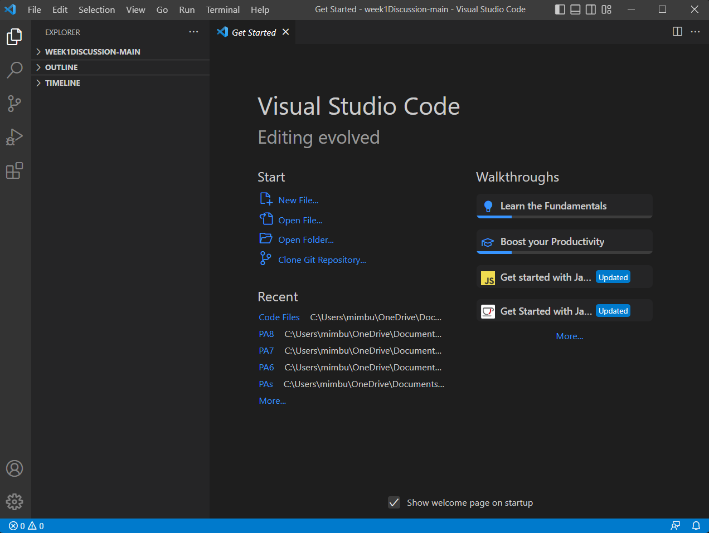

# Week 1 Lab Report

This is a tutorial on how to log into and use a course-specific account on ieng6.

To do this, you'll have to complete these three steps: 
1. Install Visual Studio Code
2. Connect Remotely
3. Try Some Commands

## Part 1 - Installing VSCode
Visual Studio Code (or VSCode for short) is the primary code editor you'll be using, as it
supports many different languages and has tools which will make our lives a lot easier.

Go to [this website](https://code.visualstudio.com/) and install the correct version of
VSCode for your operating system.

Once downloaded, open it up and it should look something like this. If yours is in a different color 
or has different UI than the photo below, it's okay since those are aspects unique to each operating system.

## Part 2 - Remotely Connecting
Now that you have VSCode downloaded, we need to work on the next step. 

If you're on Windows, you'll need to download Git for Windows to use the remote terminal. 
Go to [this link](https://stackoverflow.com/questions/42606837/how-do-i-use-bash-on-windows-from-the-visual-studio-code-integrated-terminal/50527994#50527994) 
and follow the instructions on how to install Git and open the Git Bash terminal.

Once you've
