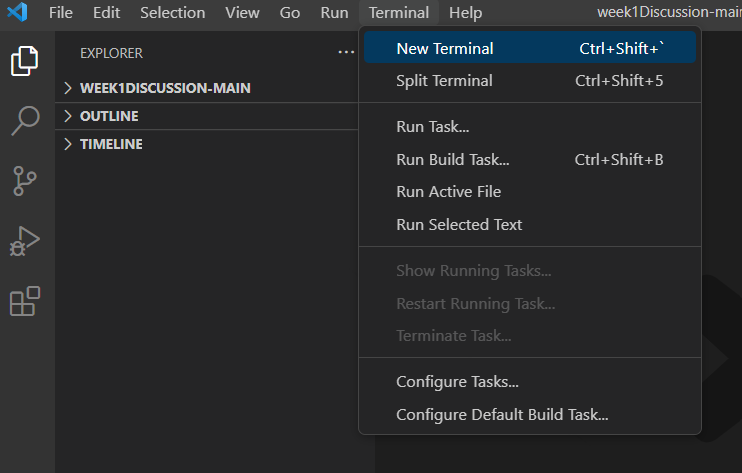
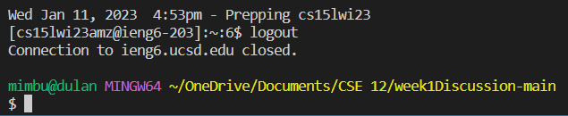

# Week 1 Lab Report

This is a tutorial on how to log into and use a course-specific account on `ieng6`.

We'll do this in three steps: 
1. Install Visual Studio Code
2. Connect Remotely
3. Try Some Commands

## Step 1 - Installing VSCode
Visual Studio Code (or VSCode for short) is the primary code editor you'll be using, as it
supports many different languages and has tools which will make our lives a lot easier.

Go to [this website](https://code.visualstudio.com/) and install the correct version of
VSCode for your operating system.

Once downloaded, open it up and it should look something like this. If yours is in a different color 
or has different UI than the photo below, it's okay since those are aspects unique to each operating system.


## Part 2 - Remotely Connecting
Now that you have VSCode downloaded, we need to work on connecting to the remote server.

If you're on Windows, theres an extra step you need to do before we connect. You'll need to download Git for Windows to access the remote terminal. 
Go to [this link](https://stackoverflow.com/questions/42606837/how-do-i-use-bash-on-windows-from-the-visual-studio-code-integrated-terminal/50527994#50527994) 
and follow the instructions on how to install Git and open the Git Bash terminal.

Once you've got your terminal set up, we can start connecting. To open your terminal, go to the top left of your VSCode and click "Terminal". In the drop down option, press "New Terminal" and the terminal should open up.



In the terminal, we'll use the `ssh` command, which will allow us to connect to the remote server. 

The command will be: `$ ssh cs15lwi23***@ieng6.ucsd.edu`, in which the three asterisks are replaced by your user-specific letters. You will notice a `$` is already input. You do not to type another one, there should only be one `$` total.

If it's your first time logging in, it will display a warning message. 

```
⤇ ssh cs15lwi23***@ieng6.ucsd.edu
The authenticity of host 'ieng6.ucsd.edu (128.54.70.227)' can't be established.
RSA key fingerprint is SHA256:ksruYwhnYH+sySHnHAtLUHngrPEyZTDl/1x99wUQcec.
Are you sure you want to continue connecting (yes/no/[fingerprint])?
```

This is normal for the first login and it's also normal to choose yes. It's letting you know that your account will be permanently saved onto the server. If the message continues to display upon login on future login attempts, it might mean someone is trying to listen in. If this is the case, check out [Ben Voigt's answer](https://superuser.com/questions/421074/ssh-the-authenticity-of-host-host-cant-be-established/421084#421084) for more information.

After confirming yes, the terminal will then prompt you to input your password. When typing your password, it will not display the characters you type. What you type will be there, it's just not visible for safety reasons. After typing your password, press enter to submit it. If you enter your password wrong, it will prompt you to re-enter your password until you get it right. If you accidently typed in your username incorrectly, open a new terminal, close the previous one, and start again.

You will know your password succeeded if the terminal displays a message similar to this:

```
Last login: Sun May 15 14:31:46 2022 from cpe-75-80-56-235.san.res.rr.com
Hello cs15lwi23***, you are currently logged into ieng6-203.ucsd.edu
```

This is also followed by some statisitics of the current state of the server. 

With that, you are now connected to the terminal.

## Part 3 - Testing
This part is more like troubleshooting and testing. We'll be testing some commands in the terminal and examine what happens.

Some helpful commands to use are:
* `cd`: change directory; switches the current directory
* `ls`: list; lists all files in the current directory
* `cp`: copy; copies groups of files in the directory
* `cat`: concatenate; combines mutliple files together

Try out these commands with different paths to test different results. You can also try to access other peoples' files using `/home/linux/ieng6/cs15lwi23/cs15lwi23***` in which the triple asterisk are another persons username. 

You might also want to test out the commands on your own personal terminal. To leave the remote terminal, simply press ctrl + D together or type the command exit. It should show a success message if it worked. 



With that, you should also be able to test the commands on your own terminal as well.
